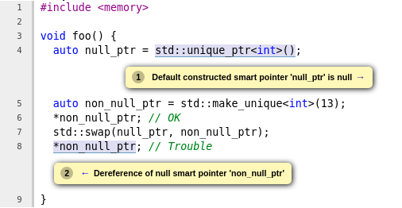

# Making Smart Pointer Checkers default checkers in the Static Analyzer

## Overview 
This project aims to complete the `SmartPtrChecker` and thus `SmartPtrModeling` checkers to detect null-dereferences of the `std::unique_ptr`. This is a continuation of the GSoC 2020 [project](https://docs.google.com/document/d/1WZSt45kZUhg0UbOv0HXBhyEYaHrb-G-TpEhj_nU041Q/edit) in the same area.

## Description
`SmartPtrChecker` used to be a checker in the Clang Static Analyzer for detecting "simple" null dereferences. The GSoC 2020 project improved upon this to provide the `SmartPtrModeling` checker, which models many of the important operations on `std::unique_ptr`, such as move, reset, release, convert to bool, etc. This project completes most of the gaps and uncompleted areas in the modelling, including the ubiquitous `std::make_unique` function and the destructor (which communicates with the `MallocChecker` to remove false positives). *Currently, we are a few bug fixes and some polishing away from making this a default checker* (as of Clang 13, it is an alpha checker).

## Revisions

One aim of this project was to make sure that no method defined on `std::unique_ptr` is left un-modelled. If we don't, CSA either does:

- *Conservative evaluation*, which leads to loss of information and possibly warnings being suppressed
- *Inlining*, which sometimes leads the CSA to falsely believe that there is a bug in the standard library code (because we have modelled parts of it and are inlining other parts). Since bugs in standard library code are normally suppressed, this leads to other bugs beings suppresed (false-negatives). For example:

```cpp
void foo() {
    auto smart = std::unique_ptr<int>(new int(13));
    auto raw = new int(29);
    // There is a leak here.
}
```
Without [D105821](https://reviews.llvm.org/D105821), this used to have **no** leak warning. The inlining of the destructor of `std::unique_ptr` led the CSA to falsely believe there was a bug in the destructor code.

### Model comparision methods of `std::unique_ptr`

[D104616](https://reviews.llvm.org/D104616) introduces modelling of comparision operator overloads of `std::unique_ptr`. It leverages the `SValBuilder::evalBinOp` to evaluate the result of the operator. More importantly, it attempts to perform a **state-split** if it is possible.

### Model `std::swap` specialization for `std::unique_ptr`

[D104300](https://reviews.llvm.org/D104300) models the `std::swap` specialization for `std::unique_ptr`. There is an existing `swap` method on `std::unique_ptr`, which performs roughly the same thing. Thus, the common code is refactored out and both methods are handled exactly the same way.




### Model `<<` operator specialization for `std::unique_ptr`

[D105421](https://reviews.llvm.org/D105421) models the `<<` operator specialization for `std::unique_ptr`. There is not that much modelling required for this method, other than invalidating the stream region.

### Model `std::make_unique` and cousins

[D103750](https://reviews.llvm.org/D103750) models the quintessential `std::make_unique` function. In this entire checker, we only account for `unique_ptr` containing pointers, not arrays - we do the same here as well. The crux of this patch is informing the CSA that we are constructing an object via this function. Ideally this should be handled automatically (as it is for constructors). But here we bail out and simply call `ExprEngine::updateObjectsUnderConstruction`. Also we ensure that the `ProgramState` knows that we have a non-null inner pointer in the `unique_ptr`.